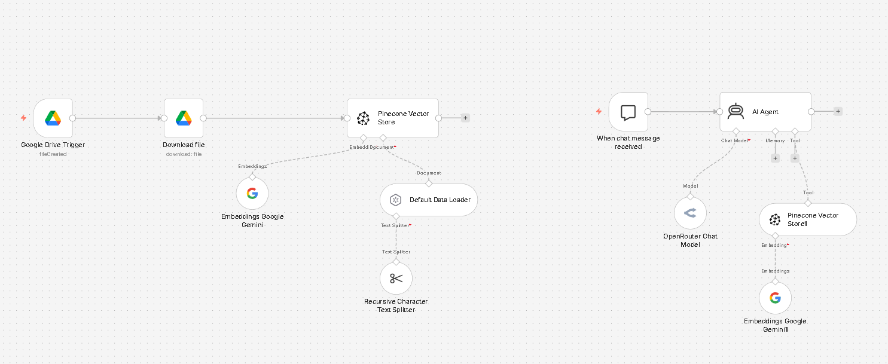

# AI RAG Chatbot

A Retrieval-Augmented Generation (RAG) chatbot built with n8n.

## Overview

This workflow allows an AI agent to answer questions using information stored in a company knowledge base.

## Architecture

Google Drive
↓
Download File
↓
Default Data Loader
↓
Recursive Character Text Splitter
↓
Google Gemini Embeddings
↓
Pinecone Vector Store
↓
AI Agent
↓
OpenRouter Chat Model

## Tech Stack

- n8n
- Google Drive
- Google Gemini Embeddings
- Pinecone
- OpenRouter
- RAG
- AI Agent

## Features

- Automatically loads documents from Google Drive
- Splits documents into smaller chunks
- Creates vector embeddings
- Stores documents in Pinecone
- Retrieves relevant information using a vector search tool
- Uses an AI Agent to answer user questions
- Includes a system prompt to reduce hallucination

## Example

User:
> What is the warranty policy?

The AI Agent retrieves the relevant information from the Tech Haven knowledge base and generates an answer based on the retrieved content.

## Workflow Screenshot

## Files

- `workflow.json` - n8n workflow export
- `screenshots/workflow.png` - workflow architecture screenshot

## Notes

This project was built as a learning and portfolio project while studying n8n, RAG, AI Agents, vector databases, and workflow automation.